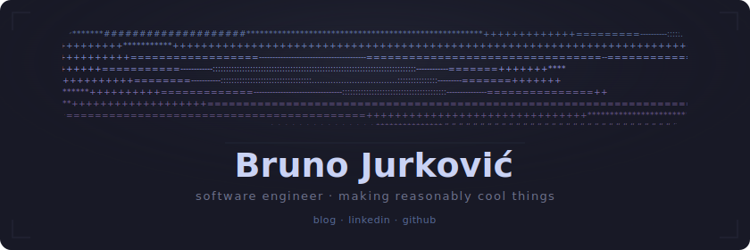

 

<a href="https://brunoj.com">blog</a> &nbsp;&middot;&nbsp; <a href="https://linkedin.com/in/brunojurkovic">linkedin</a> &nbsp;&middot;&nbsp; <a href="https://github.com/BrunoJurkovic">github</a>

---

### projects

**[dotfiles](https://github.com/BrunoJurkovic/dotfiles)** &middot; `Shell`
 
macOS tiling WM setup &mdash; yabai, skhd, sketchybar, neovim, ghostty

**[claude-code-discord-status](https://github.com/BrunoJurkovic/claude-code-discord-status)** &middot; `TypeScript`
 
Discord Rich Presence for Claude Code sessions

**[watchdog32](https://github.com/BrunoJurkovic/watchdog32)** &middot; `C++`
 
ESP32-based uptime monitoring with WhatsApp, Telegram, and Ntfy.sh alerts

**[storygraph-wrapper](https://github.com/BrunoJurkovic/storygraph-wrapper)** &middot; `Python`
 
Unofficial StoryGraph API wrapper for reading progress and book metadata

---

  <picture>
    <source media="(prefers-color-scheme: dark)" srcset="https://streak-stats.demolab.com/?user=brunojurkovic&hide_border=true&background=00000000&ring=8aadf4&fire=c6a0f6&currStreakLabel=cad3f5&sideLabels=cad3f5&currStreakNum=cad3f5&sideNums=a5adcb&dates=6e738d" />
    <source media="(prefers-color-scheme: light)" srcset="https://streak-stats.demolab.com/?user=brunojurkovic&hide_border=true&background=00000000&ring=7c3aed&fire=7c3aed&currStreakLabel=1f2328&sideLabels=1f2328&currStreakNum=1f2328&sideNums=1f2328&dates=57606a" />
    
  </picture>

  Karlovac, Croatia

